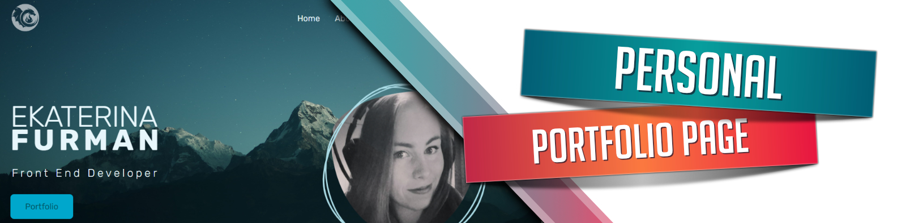

# Portfolio Page

### Languages and Tools used in this project

 

### Additional Info

  This is the first version of my portfolio. As I learn more and gain more experience the page will be upgraded with better code and more features.
  <a href="https://luxscintilla.com/">Link to the live website on my personal domain</a>

